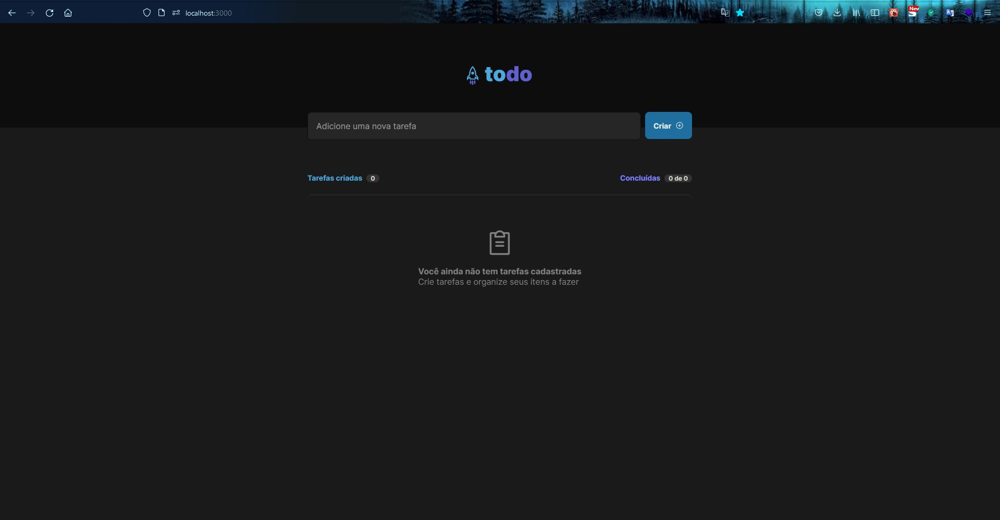
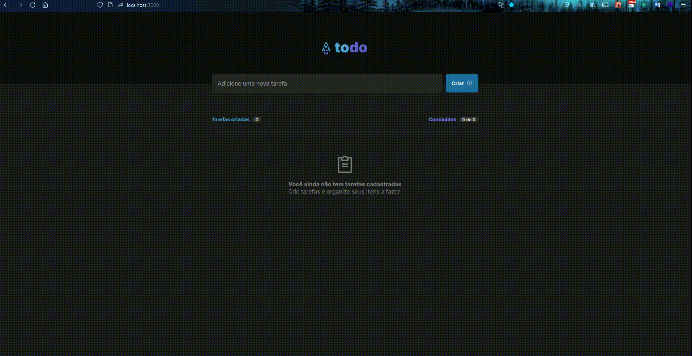

## :bookmark_tabs: Desafio
Este desafio é referente a trilha atualizada do ReactJS do IGNITE e tem como objetivo construir uma aplicação de controle de tarefas com as seguintes funcionalidades:

  - Adicionar uma nova tarefa
  - Marcar e desmarcar uma tarefa concluída
  - Remover uma tarefa da listagem
  - Mostrar o progresso de conclusão das tarefas

Nessa aplicação deve ser aplicado os conceitos do React JS como:

  - Estados
  - Imutabilidade do estado
  - Listas e chaves no ReactJS
  - Propriedades
  - Componentização
  
## :sparkler: Aplicação

